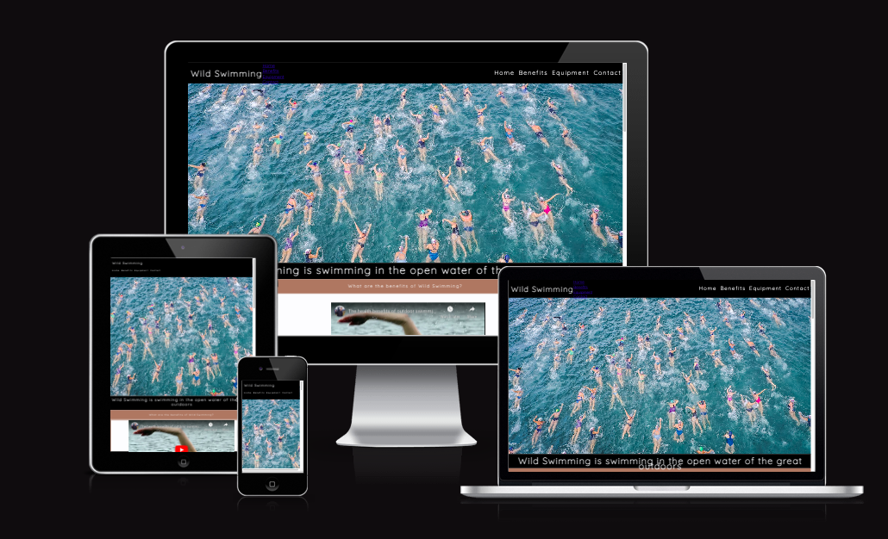

**_Wild Swimming_** 

Website Scope 
Wild swimming is a website designed to educate people about the Wild Swimming. 

It is designed to show the benefits of Wild Swimming (open water swimming) and provide ideas and recommended locations where to people can wild swim. 

The site is designed for an audience who are a novice, intermediate or experienced wild swimmer level. It is a responsive website that is viewable across different screen sizes.  

The website has the ability to keep its design and layout when viewed on a laptop, mobile phone or tablet. 
    
This is the readme file to accompany you through the design process for 

    
# Contents
* [**Website Scope and Design Choices**](<#scope>)
    * [Purpose](<#purpose>)
    * [Wireframe-Draft-Designs](<#wireframes>)
    * [Site Structure](<#site-structure>)
    * [Design Choices](<#design-choices>)
        * [Colour Scheme](<#colour-scheme>)
        * [Typography](<#typography>)
* [**Website Design**](<#features>)
    * [**Home**](<#navigation-menu>)
        * [Navigation menu](<#navigation-menu>)
        * [About](<#about>)
        * [Benefits](<#benefits>)
        * [Equipment](<#Equipment>)
        * [Locations](<#Equipment>)
        * [contact](<#contact>)
        * [footer](<#footer>)
* [**Technologies Used**](<#technologies-used>)
* [**Testing**](<#testing>)
* [**Deployment**](<#deployment>)
* [**Credits**](<#credits>)
    * [**Content**](<#content>)

## Scope
The purpose of the Wild Swimming website is to show:
* The proven benefits of Wild Swimming
* Recommended locations to Wild Swim
* A contact page for people to leave their recommended locations for Wild Swimming.

[Back to top](<#contents>)

## Wireframes

The wireframe designs were created in [Balsamiq](http://balsamiq.com).The frames are for Desktop/ Laptop, Mobile and Tablet Devices. Any variance in the design occurred in the development process.

[Back to top](<#contents>)

## Site Structure
The Wild Swimming Website was designed to be a single scroll website for four sections. It has a default loading page with each section accessible from the navigation page.
 * [Homepage](index.html) 
 * [Benefits](#main-benefits).
 * [Equipment](#what-is-needed).
 * [Contact](#recommended-locations)
The navigation bar is fixed on the top of the website to allow the user to get back to the top easily.

[Back to top](<#contents>)

## Design Choices

* ### Colour Scheme
    The colour scheme chosen for the website was a simple black, white and red. 
    The reason for the choice was to portray the information is a simply yet striking manner.

    

* ### Typography 
    The fonts chosen for the website were Roboto for the body and Quicksand for the headings. They were chosen for the mark contrast between them. 
    Roboto was chosen for the official, newspaper feel, for the main information.
    Quicksand was chosen because its easy to read and nicely contrasts with Roboto  

[Back to top](<#contents>)

# Features
The Wild Swimming website is designed to welcoming, informative and responsive. It follows the standard website functionality of a fixed Logo and Navigation bar on the top of the screen, the main data and the footer at the bottom of the page.

## Functional Features 

* ### Navigation Menu
    * A single location for the user to navigate to all of the sections of the website. Each links changes colour and underlines to show the reader which page they have clicked on.

    * Logo situated at the top left off the screen, this is also a home button.
    * Navigation - placed at the top right off the screen. 

[Back to top](<#contents>)

 * ### About Wild Swimming 
    A call to arms with a hero image and a very brief description of Wild Swimming, all age groups can go. 
    * The image is designed to show people of all ages and ability swimming.
    * A brief description of what Wild Swimming is.

[Back to top](<#contents>)

 * ### Benefits
    * Split into two sections each with a Youtube video links.
        * Section 1 provides reasons why the reader should try wild swimming.
        * The Youtube video provides a simple medium for the reader to be passed information.
        * Section 2 - shows proven health benefits from wild swimming.
            * The Youtube video provides a simple medium for the reader to be passed information.

[Back to top](<#contents>)

### Equipment
* The Equipment section provides information on what is need to start swimming, how it is different from in-door swimming.
* The sections provide practical advise in brief sentences to mirror the messages in the youtube video.
* Youtube as the medium for information. This is because it can provide allot of information very easily.

[Back to top](<#contents>)

#### Locations
* Section with specific location recommendations of where to swim.
* Designed to provide the reader with ideas and locations they can wild swim near there house.
* An embedded google map provides this information.

[Back to top](<#contents>)

### Contact
* Contact form designed to allow the reader to send in their recommeneded locations.
* Form input for people to provide their contact details as well as the recommendation name, location and ability to swim there.

[Back to top](<#contents>)

### footer
* Contains social media and safe swimming links - link to other guides and emergency services.
* These links will provide the read more data on what Wild swimming is, where they can do it, why they should do it and peoples of other people do it.

[Back to top](<#contents>)

# Technologies Used
* [HTML5](https://en.wikipedia.org/wiki/HTML5) - language used to present the structure and content of the site.
* [CSS](https://en.wikipedia.org/wiki/CSS) - used to provide style too message presented by the HTML. 
* [Balsamiq](http://balsamiq.com) - software used to create draft wireframe off the website.
* [Gitpod](https://www.gitpod.io/docs/introduction/getting-started) - used to deploy the website on to the web.
* [Github](https://github.com/) - used to host the website.

[Back to top](<#contents>)

## Testing 

# How the Code has been Validated.

The Wild Swimming has been tested through the [W3C-Validator](https://validator.w3.org/), [CSS-validator](https://jigsaw.w3.org/css-validator/) and [Dev-Tools].

* The site has been successfully tested on the HTML W3C validator website.

* The site has been successfully tested on the CSS W3C validator website.

* The site has been checked and tested on Google Dev Tools lighthouse accessibility report.

[Back to top](<#contents>)
## Testing conclusions
* The lighthouse report shows the website has poor performance on how it loads.
    It scored well for;
    * Accessibility (how accessible the site is for users).
    * Best Practices (Whether the site conforms to industry best practises).
    * SEO (Search engine optimisation) - can it be found on search engines.

[Back to top](<#contents>)

* Browser Compatibility.
The website has been tested on the Google Chrome, Microsoft Edge, Safari and Firefox. On each site i was able to navigate through the whole site.

* Responsive functionality - Website formatting.
* with the testing on the site. Example of website formatting has been found and fixed.

* From the HTML validator - the above error was found and corrected.

* With the testing of the formatting of the Benefits and Equiupment section. Examples of the about formatting were found and fixed.

[Back to top](<#contents>)

## Deployment

* The website was deployed to Github pages. This is done by;
    1. Going onto the Github repository.
    2. Click on the Setting section on the navigation bar.
    3. Click on Pages.
    4. Click on the source section - below the URL.

Live link to the Wild Swimming link is https://benjackson3811.github.io/Wild-Swim/

[Back to top](<#contents>)

## Credits.
 * Social Media HTML and CSS from the Code Institue. Love Running Project
 * Fonts from Google Fonts
 * Map from Google Maps.
 * YouTube Video from Youtube.
 * Icons froms Font Awesome.
 * Photos from Pexels

[Back to top](<#contents>)

	
 

